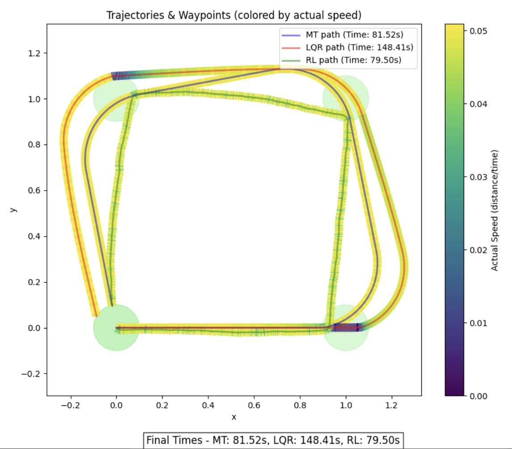
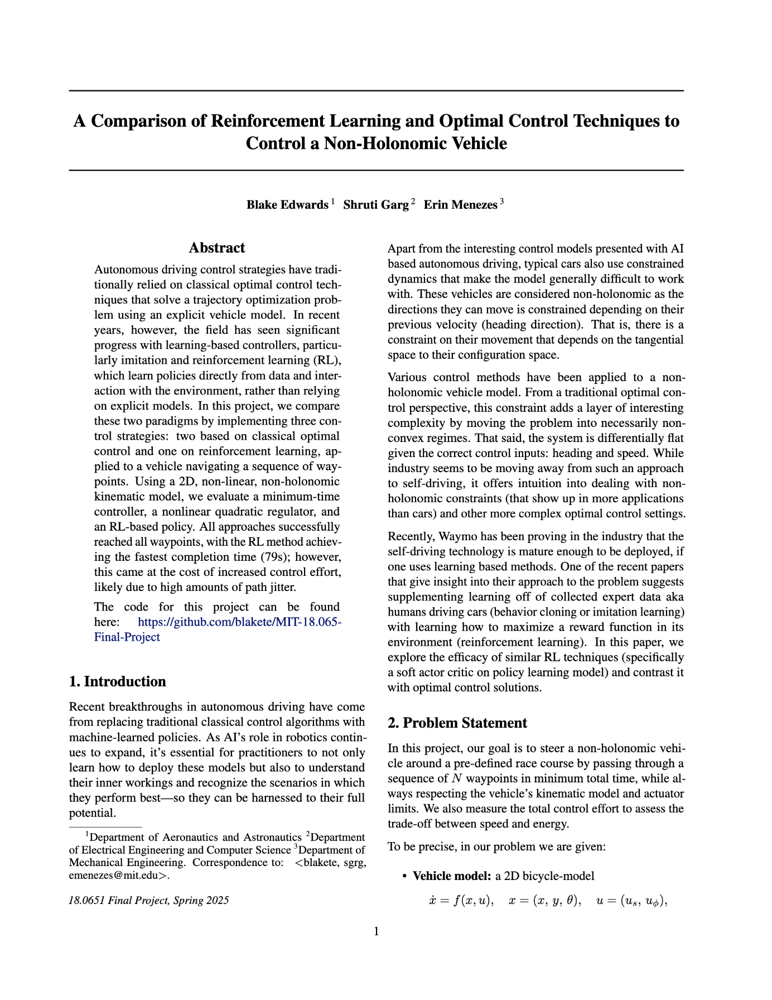

# MIT 18.065: Matrix Methods – Final Project – RL vs Optimal Control in Autonomous Vehicle Navigation

A comparative study of reinforcement learning and classical optimal control for autonomous navigation of a non-holonomic vehicle through waypoints using a 2D kinematic model. We implement and evaluate three strategies—minimum-time control, nonlinear quadratic regulator, and RL—with RL delivering the fastest completion (79s) but at higher control effort. Dive into the code and results from our MIT 18.065 final project.

### Sneak Peak of Results

<a href="https://github.com/blakete/MIT-18.065-Final-Project/blob/main/MIT_18_065_Final_Project_Report.pdf">
  
</a>

### See the Report

<div>
  <a href="https://github.com/blakete/MIT-18.065-Final-Project/blob/main/MIT_18_065_Final_Project_Report.pdf">
    
  </a>
</div>

**Authors**: Blake Edwards[^1], Shruti Garg[^2], Erin Menezes[^3]

[^1]: MIT, Department of Aeronautics and Astronautics
[^2]: MIT, Department of Electrical Engineering and Computer Science
[^3]: MIT, Department of Mechanical Engineering

**Link to full project report**: https://github.com/blakete/MIT-18.065-Final-Project/blob/main/MIT_18_065_Final_Project_Report.pdf <br>
**Link to final presentation slides**: https://docs.google.com/presentation/d/1sp6oyPiH-t7UUCnZQJGkI6kWlt2SCyK1Z28j_DZ1J14/edit?usp=sharing

---

## Preview of RL Controller

/Users/blake/repos/MIT-18.065-Final-Project/src/rl_control/visualize/misc/race_course_4000.mp4

## Running the code

```console
python3 train_ppo_bike.py --num-envs 32 --total-timesteps 8192000 --use-wandb 2>&1 | tee train_fr.log
```

## Experiments

```console
source /Users/blake/repos/18.065-Final-Project/.venv/bin/activate
```

```console
python3 train_ppo_bike.py --num-envs 32 --total-timesteps 8192000 --use-wandb 
```

```console
python3 train_ppo_bike.py --num-envs 32 --total-timesteps 8192000 --use-wandb --learning-rate 1e-4 --gpu 1
```

```
python3 train_ppo_bike.py --num-envs 32 --total-timesteps 8192000 --use-wandb --learning-rate 3e-4 --clip-ratio 0.2 --gpu 1
```

---

## Blake Experimentation 04.29.2025

```console
python3 visualize_ppo.py --model "/Users/blake/repos/18.065-Final-Project/experiment_runs/ppo_bike_20250427_002517/ppo_bike_agent_final.pt"
```

## What to Do Next

1. **You need to train a new agent** with these fixes. The previous model can't be fixed because it learned behaviors based on different rules.

2. Run the training script:
   ```bash
   cd /Users/blake/repos/18.065-Final-Project
   ./train_scripts/train_new_agent.py
   ```

3. After training, visualize the new agent:
   ```bash
   python -m src.rl_bike_race.visualize.visualize_ppo --model "path/to/new/model/ppo_bike_agent_final.pt"
   ```

The speed reward should encourage the agent to move rather than just turn in place. The reward function now explicitly values both getting closer to the waypoint AND maintaining a reasonable speed.

## Start a new `tmux` based training experiment

1. Start a new `tmux` session

    ```console
    tmux
    ```

2. Prepare for training run

    ```console
    source .venv/bin/activate
    export PYTHONPATH="/Users/blake/repos/18.065-Final-Project"
    ```

3. Launch training run

    ```console
    python3 train_scripts/train_new_agent.py --gpu 0 --timesteps 100_000_000 --max-steps 300
    python3 train_scripts/train_new_agent.py --gpu 1 --timesteps 100_000_000 --max-steps 200
    python3 train_scripts/train_new_agent.py --gpu 1 --timesteps 100_000_000 --max-steps 300
    ```

    * `ctrl+b` `d` to detach from tmux session


---

## Visualize Trained Agent Policy

```console
export PYTHONPATH="/Users/blake/repos/18.065-Final-Project"
```

```console
python3 src/rl_bike_race/visualize/visualize_ppo.py --model "/Users/blake/repos/18.065-Final-Project/experiment_runs/ppo_bike_20250429_013941/models/agent_update_10.pt"
python3 src/rl_bike_race/visualize/visualize_ppo.py --hidden-dim 128 --model "/Users/blake/repos/18.065-Final-Project/experiment_runs/ppo_bike_20250429_013941/models/agent_update_10.pt"


```


python3 src/rl_bike_race/visualize/visualize_ppo.py --hidden-dim 128 --model "/Users/blake/repos/18.065-Final-Project/experiment_runs/ppo_bike_20250429_021009/models/agent_update_10.pt"

python3 src/rl_bike_race/visualize/visualize_ppo.py --hidden-dim 128 --steps 300 --model "/Users/blake/repos/18.065-Final-Project/experiment_runs/ppo_bike_20250429_022419/models/agent_update_5.pt"

```

## Run Race Script

```console
source .venv/bin/activate
export PYTHONPATH="/Users/blake/repos/18.065-Final-Project"
```

```console
python3 src/rl_bike_race/run_race/run_race.py \
    --waypoints "/Users/blake/repos/18.065-Final-Project/src/rl_bike_race/run_race/race_1_waypoints.csv" \
    --model "/Users/blake/repos/18.065-Final-Project/experiment_runs/ppo_bike_20250429_063417/models/agent_update_2685.pt" \
    --device cpu \
    --steps 4000 \
    --generate_gif True \
    --gif_output_path "/Users/blake/repos/18.065-Final-Project/src/rl_bike_race/run_race/race_course_4000_agent_2685.gif" \
    --state_output_path "/Users/blake/repos/18.065-Final-Project/src/rl_bike_race/run_race/states_4000_agent_2685.npy"
```

```console
python3 src/rl_bike_race/run_race/run_race.py \
    --waypoints "/Users/blake/repos/18.065-Final-Project/src/rl_bike_race/run_race/race_1_debug_waypoints.csv" \
    --model "/Users/blake/repos/18.065-Final-Project/experiment_runs/ppo_bike_20250429_063417/models/agent_update_100.pt" \
    --device cpu \
    --steps 3000 \
    --generate_gif True \
    --gif_output_path "/Users/blake/repos/18.065-Final-Project/src/rl_bike_race/run_race/debug_race_course_6000_agent_50.gif" \
    --state_output_path "/Users/blake/repos/18.065-Final-Project/src/rl_bike_race/run_race/debug_race_states_6000_agent_50.npy"
```

